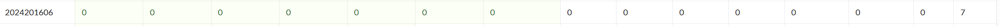

# bomblab 报告

姓名：童奕涵

学号：2024201606

| 总分 | phase_1 | phase_2 | phase_3 | phase_4 | phase_5 | phase_6 | secret_phase |
| --------- | ------------- | ------------- | ------------- | ----------------- |-----------|-----------|-----------|
| 7         | 1             | 1             | 1             | 1                 |1          |1          |1          |


scoreboard 截图：



<!-- TODO: 用一个scoreboard的截图，本地图片，放到 imgs 文件夹下，不要用这个 github，pandoc 解析可能有问题 -->

## 解题报告

<!-- 对你拆掉的每个phase进行分析，并写出你得出答案的历程 -->

<!-- 如果能用伪代码还原题目源代码最佳（不属于先前提到的大段代码），语言描述自己的分析也可，每道题目的图片不建议超过两张 -->

### phase_1

```c
An endless Light awaits you in a perfect world of silent song...
```

首先，我傻乎乎的读了一遍strings_not_equal函数，发现他的作用确实是判断两个字符串是否相同，然后比较的两个字符串一个是我输入的，一个是内存中有的，于是通过x/s指令得到内存中的字符串，并作为输入，成功拆除第一个炸弹。

### phase_2

```c
1055048 1230320 555042 681569
```
这次学聪明了，知道通过上面的字符串%d%d%d%d发现__isoc99_sscanf@plt是要读入四个整数，然后储存在rsp中然后通读了一下汇编，发现其实最后就是比对结果的那四个数和输入的四个数是否相同，于是直接把结果的四个数复制下来，然后作为答案输入并拆除第二个炸弹

### phase_3

```c
4 15
```
通过读汇编代码发现，这个炸弹就是读入两个整数，第一个整数控制它在代码中跳转的地方这个整数的有一个很小的范围限制，另一个数用来和对应位置内存中的数去比较，如果笔者没记错的话，应该是要求内存中的这个数必须是正数，于是逐一检查对应的内存，发现在第一个整数为4的时候内存中存的数计算后是整数，于是得到那个结果，并作为输入，成功拆除第三个炸弹。

### phase_4

```c
31 AC
```
这个炸弹的本意应该是让我们学会阅读汇编的函数（虽然在前面的炸弹中已经傻乎乎的阅读了），然后第一个函数应该是一个递归求$2^n-1$的函数，所以第一个的答案是31，然后我们发现其实并不需要麻烦的去阅读那个函数，其实直接看返回值即可，那么检查返回值是AC，并作为读入，成功拆除

### phase_5

```c
HbngfH
```
这个炸弹是要将我们的输入add 0xf,再and 0xf，然后作为下标到一个字符串中去寻找相应的字母来组成答案的单词，于是经过二进制的推算后得到了这几个字母作为输入即可得到对应的下标，进一步得到目标字符串。

### phase_6

```c
2 4 1 3 5 6 binary
```
经过长时间的仔细阅读后，我们理解到了这个代码的核心就是给你了几个值，你需要给他排序，当然实际实践中有许多检查工作以及它非常有特色的链表式存储，但是读懂汇编代码后还是非常的简单的找到了对应的输入。这里我傻乎乎的遇到了一个小问题，比较是按照int 比较的而不是long,因此应该查询int值而不是long值。
### secret_phase

```c
33113
```
我们发现了secret_phase藏在了phase_defused函数里面，经过超级长超级长的时间阅读我终于正确的理解了该炸弹的意思，我需要通过给他一个长度不超过13的字符串来控制一个马在一个有障碍的图上面抵达（4，7）这个点，其中最最最重要的是有蹩马腿的规则（一开始没看明白，没有注意到那处是add，迷惑了很长时间）然后在正确理解代码后我将用链式结构存储的图打印了出来，手动找到了一条不蹩马腿的路径，结果bomb!差一点爆炸，这个发现可恶的小端法，导致整个图都反过来了，修正后顺利解决最后一枚炸弹。
## 反馈/收获/感悟/总结

花费的时间：4天左右，因为每天做的时间比较多。

难度：前期的难度主要在于看懂到底想让我输入什么东西，输入的东西到底存在哪里了，主要是很多这些负责处理输入的东西并不容易看懂。当然在弄明白输入后这个炸弹本身的难度倒是不高了，后期的难度就是逻辑变得复杂，而且实现有些时候写的很诡异，需要更长的时间才能看明白，而且阅读汇编代码还是比较麻烦的，需要翻来翻去，还得注意许多后面标识数据类型和add与mov是有区别的，（看时间长了容易看花）不过相对来说，解决具体的问题比研究如何输入更加有趣
<!-- 这一节，你可以简单描述你在这个 lab 上花费的时间/你认为的难度/你认为不合理的地方/你认为有趣的地方 -->
收获方面：对于汇编的熟练程度有所提升，不过最大的提升大概还是调试gdb用的更加熟练了。
<!-- 或者是收获/感悟/总结 -->
感悟：看吧，看吧，总有一天能看懂的

不合理的地方：虽然函数名有所提升，但是这些输入的函数能不能给注释一下,对于刚开始做phase_1的时候很不友好。

有趣的地方：完全没有，看的眼睛疼，比cache_lab没意思多了，建议引入打榜机制（虽然不太好引入）（其实还是有有趣的地方，比如这个辛辛苦苦看完一个函数，发现这个函数和它的名字的作用完全相同，然后就被自己给蠢笑了。
<!-- 200 字以内，可以不写 -->
最后，因为临近期末，很遗憾没能完成nuclear_lab,如果没有期末这么多事情，我非常的愿意花时间来完成它。
## 参考的重要资料

<!-- 有哪些文章/论文/PPT/课本对你的实现有重要启发或者帮助，或者是你直接引用了某个方法 -->
没有资料，全凭眼睛看，眼睛疼。
<!-- 请附上文章标题和可访问的网页路径 -->
